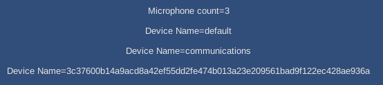

# UnityWebGLMicrophone
WebGL Microphone module for Unity



This package provides a WebGL module that allows the `UnityEngine.Microphone` API to be used on the `WebGL` with the sample interface.

That is, with one exception as the following script is needed in the scene to relay Microphone updates from `WebGL` to `C#`.

```C#
#if UNITY_WEBGL && !UNITY_EDITOR
        void Awake()
        {
            Microphone.Init();
            Microphone.QueryAudioInput();
        }
#endif

#if UNITY_WEBGL && !UNITY_EDITOR
        void Update()
        {
            Microphone.Update();
        }
#endif
```
